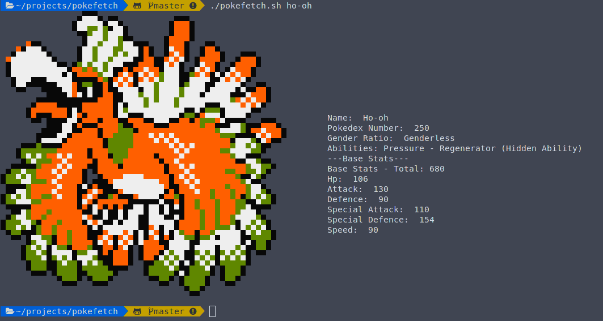

<div align="center"> 
<h1> Hi there! </h1>
 
</div>
---

I'm Ryan McCormick, an incoming junior at Binghamton University studying Computer Science and Mathematics. I love to learn and be challenged, and I find space and the physics related to it, to be extremely cool.

---

# Coolest Projects At The Moment

---

## Pokefetch

This is a neat terminal tool I am working on that basically puts a pokedex right in your shell using Bash and Python! You just run the command:

```
./pokefetch.sh <pokemon_name>
```

and get a nice picture and relevant information on the pokemon right there in a screenfetch-esque fashion:




For a more detailed description, you can find the GitHub repository [here](https://github.com/rmccorm4/Pokefetch).

---

## Archon

This is currently a very basic programming language that I am writing from scratch with my friend Thomas in Python.
I enjoy constantly learning as much as possible, as long as it interests me, and this project is something I plan to work
on long term, as it has seemingly-endless possibilities, especially for two people to work on.

The current progress is kept [here](https://github.com/rmccorm4/Archon), but there isn't much to see.

---

# Work Experiences

Currently I am an 'Automatic Target Recognition Center (ATRC) intern' at Wright-Patterson Air Force Base in Dayton Ohio.
I am conducting research with a masters student on representations of convolutional neural networks in order
to better understand how and why they work. There are many unanswered questions in the field regarding why
neural networks perform so well, and it's usually just described as magic. Our goal is to de-mystify that
magic this summer.
